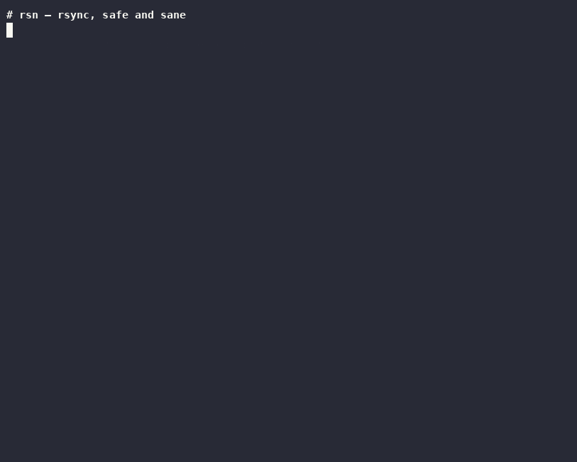

# rsn — rsync, safe and sane

A UX layer over `rsync`. The battle-tested engine does all the real work; **rsn**
just refuses to let a trailing slash ruin your day.

Single-file Python 3 (stdlib only). No dependencies. Works anywhere rsync works.



```
$ rsn mirror ~/photos /mnt/backup/photos

Plan: rsn mirror → /mnt/backup/photos
  (rsync -a --delete --mkpath ~/photos/ /mnt/backup/photos)
  + 14 new   ~ 2 updated   - 1 deleted   (48.2 MB to transfer)
    + 2026-07/IMG_2214.jpg
    + 2026-07/IMG_2215.jpg
    ~ index.db
    - tmp/cache.bin

DELETE 1 files and apply these changes? [y/N]
```

## Why does this exist?

rsync is one of the greatest tools ever written — and its interface is a 1996
design that never got revisited:

- **The trailing-slash trap.** `rsync -a src dst` and `rsync -a src/ dst` do
  fundamentally different things, distinguished by one invisible character.
  Combined with `--delete`, a misplaced slash has wiped countless backups.
- **Safety is homework.** The official advice is "always run `--dry-run`
  first" — meaning the safety model is *user discipline*, not tool design.
- **Flag archaeology.** `-a` is secretly `-rlptgoD`. Nobody remembers that.
- **The filter mini-language.** Copying only `*.jpg` requires
  `--include='*/' --include='*.jpg' --exclude='*'` *in that order*. This
  single incantation powers a measurable fraction of Stack Overflow.
- **Error codes as UX.** `rsync error: some files/attrs were not transferred
  (code 23)`. Which files? Why?

rsn fixes the *interface* and leaves the engine alone. It builds the correct
rsync command, dry-runs it, shows you exactly what will happen, and only then
commits. (This is the `tldr`-over-`man`, `bat`-over-`cat` pattern: wrap the
trusted engine, don't fork it.)

## Install

```bash
curl -o ~/.local/bin/rsn https://raw.githubusercontent.com/sunkencity999/rsn/main/rsn.py
chmod +x ~/.local/bin/rsn
```

Requires Python 3.8+ and rsync (already on virtually every Linux/macOS box).

## Commands

| Command | What it does | Deletes at DST? |
|---|---|---|
| `rsn copy SRC DST` | Simple additive copy (`-rlt`) | never |
| `rsn backup SRC DST` | Archive copy — perms, owners, times, links (`-a`) | never |
| `rsn mirror SRC DST` | Make DST exactly match SRC (`-a --delete`) | yes — guarded |
| `rsn explain 'rsync …'` | Decode any rsync command into English | n/a |

## The safety model

1. **Explicit intent, no slash divination.** On a terminal, rsn *asks*:

   ```
   Copy /home/chris/photos …
     1) as a folder    → /mnt/backup/photos/
     2) contents only  → /mnt/backup/  (files land directly inside)
   Which? [1/2]
   ```

   Or say it up front with `--as-folder` / `--contents`. A trailing slash on
   SRC is still honored as "contents" — existing muscle memory keeps working.

2. **Automatic preview.** Every run dry-runs first and shows
   `+new ~updated -deleted` counts, transfer size, and sample paths *before
   anything is touched*. Confirm to proceed.

3. **Delete guard.** `rsn mirror` refuses to remove more than **20% of the
   destination** (when that's also >10 files) without `--force-delete`:

   ```
   ⛔ Delete guard: this would remove 30 of ~30 files at the destination (100%).
      If that's really what you want, re-run with --force-delete.
   ```

   Exits with code 3, so cron jobs fail loudly instead of emptying a backup
   when a source directory vanishes out from under them.

4. **Script-safe.** `--yes` skips confirmation for automation. On a non-TTY
   *without* `--yes`, rsn refuses to act rather than guess.

## Use cases

### Monthly backup to an external drive

```bash
rsn mirror ~/Documents /mnt/external/Documents
```

Preview, confirm, done. If you plug in the wrong drive or the source is
half-mounted, the delete guard catches the "would remove 94% of destination"
disaster before it happens.

### Deploy a static site

```bash
rsn mirror ./public deploy@web01:/var/www/site --yes -- --chmod=D755,F644
```

Anything after `--` passes straight to rsync, so advanced flags still work.

### Pull just the photos off a huge directory tree

```bash
rsn copy nas:/media/dump ~/photos --contents --only '*.jpg' --only '*.heic'
```

No include/exclude ordering rules to memorize — `--only` generates the
correct filter chain (`--include='*/' --include=PAT --exclude='*'
--prune-empty-dirs`) for you.

### Nightly cron mirror that can't nuke itself

```cron
15 2 * * * rsn mirror /srv/data /mnt/backup/data --yes || notify "backup failed"
```

Normal drift syncs fine. If `/srv/data` ever comes up empty (dead mount,
fat-fingered rename), the guard trips, exit code 3, your alert fires, and
your backup is still there in the morning.

### Decode that command you copied from Stack Overflow

```
$ rsn explain 'rsync -avzP --delete --exclude .git src/ user@host:/backups/src'

Flags:
  -a          recurse + preserve symlinks, perms, times, group, owner, devices (= -rlptgoD)
  -v          list transferred files
  -z          compress data in transit (good over networks, wasted effort locally)
  -P          keep partially transferred files and show per-file progress
  --delete    DELETE files at destination that don't exist at source ⚠ DESTRUCTIVE
  --exclude   skip files matching pattern  [.git]

Paths:
  SRC  src/
       trailing slash → copies the CONTENTS of this directory into DST
  DST  user@host:/backups/src  (trailing slash on DST is cosmetic)

Danger check:
  --delete removes anything at DST that isn't at SRC.
  Always run with -n (dry-run) first, or use `rsn mirror` which previews automatically.

English summary:
  Mirror (with deletions!) contents of src/ → user@host:/backups/src
```

Knows ~50 flags, including the sneaky ones (`--append`, `--size-only`,
`--remove-source-files`, `--ignore-existing`) with caution markers.

### Just see what would happen

```bash
rsn mirror ~/music /mnt/backup/music -n     # preview and stop, change nothing
```

## Options reference

```
--contents          copy the CONTENTS of SRC into DST (like src/)
--as-folder         copy SRC as a folder inside DST (like src)
--only PATTERN      transfer only matching files (repeatable)
--exclude PATTERN   exclude matching files (repeatable)
-n, --dry-run       show the preview and stop
-y, --yes           skip confirmation (for scripts/cron)
--force-delete      override the mirror delete guard
-q, --quiet         minimal output
-- ARGS...          pass everything after -- straight to rsync
```

Exit codes: `0` success / nothing to do · `1` error · `3` delete guard tripped ·
otherwise rsync's own exit code.

## What rsn is not

- **Not a fork.** rsync's engine (delta algorithm, protocol, platform quirks)
  is untouched and updates with your system.
- **Not a daemon or sync service.** For continuous sync, use Syncthing; for
  cloud remotes, use rclone. rsn is for the classic rsync use case: local ↔
  local/SSH copies and mirrors, done deliberately.
- **Not exhaustive.** Power users with 12-flag invocations should keep using
  rsync directly (though `rsn explain` might still be handy).

## License

MIT. See [LICENSE](LICENSE).
